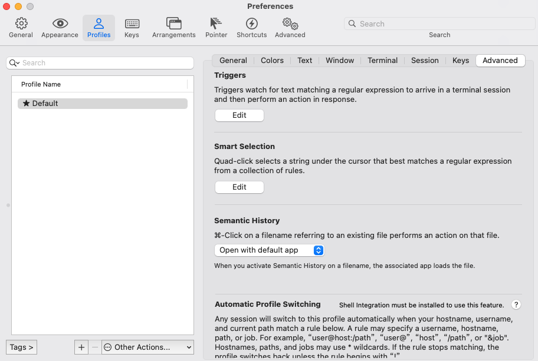
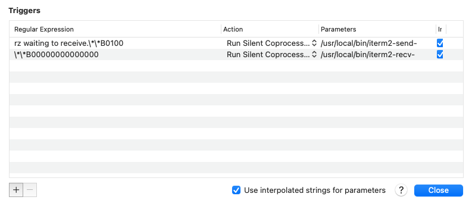
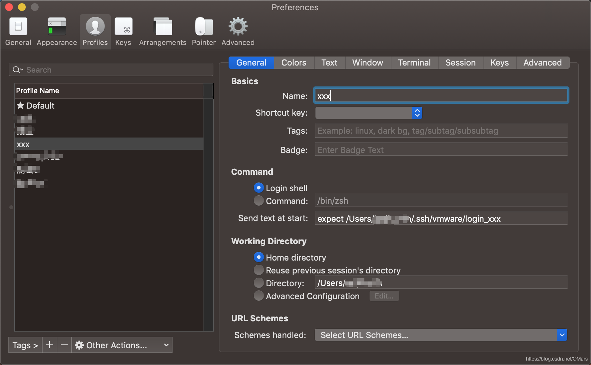
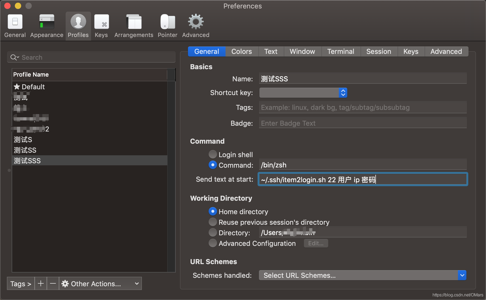
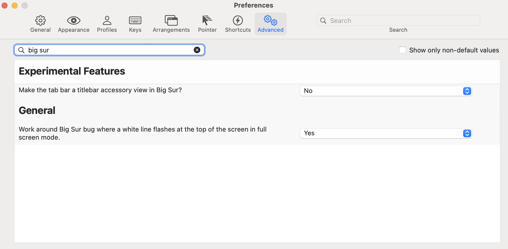

# Mac配置ITerm2

- [install-shell-integration](#install-shell-integration)
- [配置lrzsz](#配置lrzsz)
- [配置zsh](#配置zsh)
- [安装Oh-My-Zsh](#安装Oh-My-Zsh)
- [修改皮肤文件](#修改皮肤文件)
- [加载皮肤](#加载皮肤)
- [添加插件](#添加插件)
- [配置profiles](#配置profiles)
    - [1.expect+配置文件](#1.expect+配置文件)
    - [2.shell脚本](#2.shell脚本)
- iterm2顶部白条闪烁


## install-shell-integration

```bash
安装完成之后会有一个指示标，需要弄掉

Preferences > Profiles > (your profile) > Terminal, scroll down to "Shell Integration", and turn off "Show mark indicators".
```


## 配置lrzsz

```bash
brew install lrzsz
```

[下载](https://github.com/xmvper/iterm2-zmodem)

iterm2-send-zmodem.sh
iterm2-recv-zmodem.sh

```bash
mv iterm2-send-zmodem.sh /usr/local/bin/
mv iterm2-recv-zmodem.sh /usr/local/bin/
chmod +x iterm2-*
```

打开iterm2 按住command + ，进入 Preperences->Profiles–>Advanced找到Triggers点击edit





```bash
Regular expression: rz waiting to receive.\*\*B0100
Action: Run Silent Coprocess
Parameters: /usr/local/bin/iterm2-send-zmodem.sh
Instant: checked

Regular expression: \*\*B00000000000000
Action: Run Silent Coprocess
Parameters: /usr/local/bin/iterm2-recv-zmodem.sh
Instant: checked
```

如果使用 brew 下载脚本

```
brew install laggardkernel/tap/iterm2-zmodem
但是如果用上面这种方式安装的，前面配置的sh脚本的名称有变化，自己最好去/usr/local/bin下面确认一下，需要修改成
/usr/local/bin/iterm2-zmodem-send
/usr/local/bin/iterm2-zmodem-recv
```

```bash
-+, --append:将文件内容追加到已存在的同名文件
-a,--ascii:以文本方式传输
-b, --binary:以二进制方式传输，推荐使用
--delay-startup N:等待N秒
-e, --escape:对所有控制字符转义，建议使用
-E, --rename:已存在同名文件则重命名新上传的文件，以点和数字作为后缀
-p, --protect:对ZMODEM协议有效，如果目标文件已存在则跳过
-q, --quiet:安静执行，不输出提示信息
-v, --verbose:输出传输过程中的提示信息
-y, --overwrite:存在同名文件则替换
-X, --xmodem:使用XMODEM协议
--ymodem:使用YMODEM协议
-Z, --zmodem:使用ZMODEM协议
--version：显示版本信息
--h, --help：显示帮助信息
```


## 配置zsh


### 安装Oh-My-Zsh

安装脚本来自于[Oh My Zsh官方仓库](https://links.jianshu.com/go?to=https%3A%2F%2Fgithub.com%2Fohmyzsh%2Fohmyzsh)

```bash
sh -c "$(curl -fsSL https://raw.githubusercontent.com/ohmyzsh/ohmyzsh/master/tools/install.sh)"
```


### 修改皮肤文件

```bash
vim ~/.oh-my-zsh/themes/fishy.zsh-theme
```


### 加载皮肤

```bash
sed -i '' 's/^\(ZSH_THEME=\)".*"$/\1"fishy"/g' ~/.zshrc
source ~/.zshrc
```


### 添加插件

[zsh-syntax-highlighting](https://links.jianshu.com/go?to=https%3A%2F%2Fgithub.com%2Fzsh-users%2Fzsh-syntax-highlighting)

```bash
# mac os
brew install zsh-syntax-highlighting
echo 'source /usr/local/share/zsh-syntax-highlighting/zsh-syntax-highlighting.zsh'  >> ~/.zshrc
source ~/.zshrc
```

[zsh-autosuggestions](https://links.jianshu.com/go?to=https%3A%2F%2Fgithub.com%2Fzsh-users%2Fzsh-autosuggestions)

```bash
#mac os
brew install zsh-autosuggestions
echo 'source /usr/local/share/zsh-autosuggestions/zsh-autosuggestions.zsh' >> ~/.zshrc
source ~/.zshrc
```


## 配置profiles

### 1.expect+配置文件

#### 第一种 expect脚本文件

1. 在一个目录下创建一个expect脚本文件，建议在自己的.ssh目录下，为了分类可以有子目录。

内容如下：

```bash
# !/usr/bin/expect -f
set user ec2-user
# set password
set host ec2-13-233-143-110.ap-south-1.compute.amazonaws.com
set port 22
set timeout 30

spawn ssh -i ~/.ssh/mengmai.pem  $user@$host
expect {
    "(yes/no)?" {send "yes\n";exp_continue}
    "*password:*" {send "$password\n"}
}
interact
```

2. 进入iterm2->preference->profiles




#### 第二种 登陆加参数

1. 创建登陆脚本

```bash
# !/usr/bin/expect -f
set port [lindex $argv 0]
set user [lindex $argv 1]
set host [lindex $argv 2]
set passwd [lindex $argv 3]
set timeout 30
spawn ssh -p $port $user@$host
expect {
    "(yes/no)?" {send "yes\n";exp_continue}
    "*password:*" {send "$passwd\n"}
}
interact

# !/usr/bin/expect -f
set user [lindex $argv 0]
set host [lindex $argv 1]
set passwd [lindex $argv 2]
set timeout 30
spawn ssh -i ~/.ssh/server.pem -t $user@$host
expect {
	"(yes/no)?" {send "yes\n";exp_continue}
	"Enter passphrase for key*" {send "$passwd\n"}
}
interact

# !/usr/bin/expect -f
set user [lindex $argv 0]
set host [lindex $argv 1]
set passwd [lindex $argv 2]
set timeout 30
spawn ssh -i ~/.ssh/server.pem -t $user@$host
expect {
	"*yes/no*" {send "yes\r";exp_continue;}
	"Enter passphrase for key*" {send "$passwd\r"}
}

interact

# !/usr/bin/expect -f

set pem [lindex $argv 0]
set user [lindex $argv 1]
set host [lindex $argv 2]
set passwd [lindex $argv 3]
set timeout 30
spawn ssh -i $pem -t $user@$host
expect {
  "*yes/no*" {send "yes\r";exp_continue;}
  "Enter passphrase for key*" {send "$passwd\r"}
}
interact
```

2. 授予执行权限

```bash
chmod +x file
```

3. 进入iterm2->preference->profiles




### 2.shell脚本

```bash
#!/bin/bash
# ssh -i ~/.ssh/mengmai.pem -t ec2-user@ec2-13-233-143-110.ap-south-1.compute.amazonaws.com
ssh -i ~/.ssh/mengmai.pem -t ec2-user@$1

# !/bin/bash
pem='~/.ssh/server.pem'
user='ec2-user'
passwd='t9QbBgVZRjZ4sW3Y'

echo 'please input host!'
while read host; do
  expect ~/.ssh/moj.sh $pem $user $host $passwd
  break
done
```


## iterm2顶部白条闪烁

