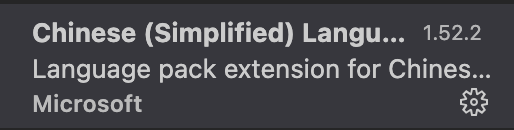
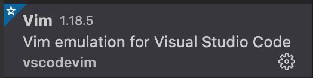
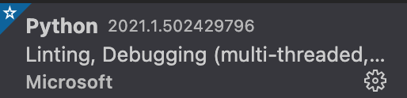
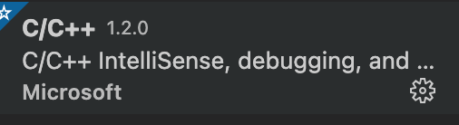
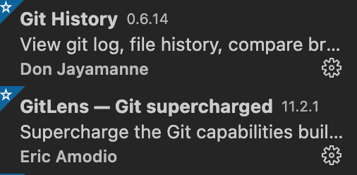
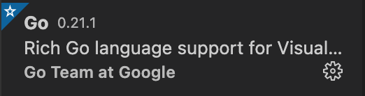
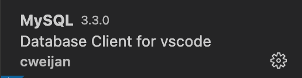
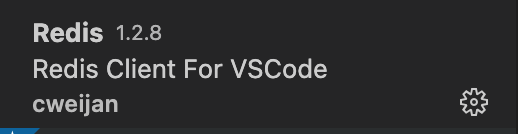

# Mac配置VScode

## 配置中文

- Chinese (Simplified) Language Pack for Visual Studio Code



## 配置vim编辑

- Vim




## 配置python

- Python



## 配置C++

- C/C++



## 配置git

- Git History
- GitLens — Git supercharged



## 配置goland

- Go



```bash
#brew安装go
brew install go
#go安装目录
#brew安装之后会是这个路径GOROOT="/usr/local/Cellar/go/1.15.6/libexec"
export GOROOT=/usr/local/go 

#go工作目录,作为编译后二进制的存放目的地和import包时的搜索路径。其实说通俗点就是你的go项目工作目录。
#brew安装成功后会是这个路径GOPATH="/Users/zhengdongqi/go"
export GOPATH=/Users/zhengdongqi/gocode
#将go可执行文件加入PATH中，使GO命令与我们编写的GO应用可以全局调用
export PATH=$PATH:$GOROOT/bin:$GOPATH/bin
#使用go env可以查看当前环境

#使用国内下载源
export GOPROXY=https://goproxy.io
#换下载源
go env -w GOPROXY=https://goproxy.cn,direct
# 自动使用go mod
go env -w GO111MODULE=auto

go get -u -v github.com/nsf/gocode 
go get -u -v github.com/rogpeppe/godef 
go get -u -v github.com/golang/lint/golint 
go get -u -v github.com/lukehoban/go-outline 
go get -u -v sourcegraph.com/sqs/goreturns 
go get -u -v golang.org/x/tools/cmd/gorename 
go get -u -v github.com/tpng/gopkgs 
go get -u -v github.com/newhook/go-symbols 
go get -u -v golang.org/x/tools/cmd/guru
```


## 配置mysql

- MySQL



## 配置redis

- Redis



## 远程工具

- Remote Developmen


## 配置web

- JavaScript (ES6) code snippets 快速书写ES6代码 
- open in browser
- HTML CSS Support 便于在html/css文件中快速书写属性
- HTML Snippets
- px to rem & rpx (cssrem) 将css中的px自动转换为rem.再也不用计算器
- ESLint Js 语法检测
- CSS Peek 在Html和Css文件中定位class和id样式. （右键单击选择器时，选择 Go to Definition和 Peek definition，vue中不可用）
- Live Server 快速启动一个本地服务器
- Auto Rename Tag - 自动重命名配对的HTML / XML标记 
- Auto Close Tag 自动关闭配对的HTML / XML标记 
- Material Theme 主题安装
- Material Theme Icons 主题图标
- ommunity Material Theme 主题选择
- Prettier - Code formatter 使代码更漂亮
- Bracket Pair Colorizer2
- indent-rainbow 缩近明显
- REST Client 运行代码
- Live Sass Compiler