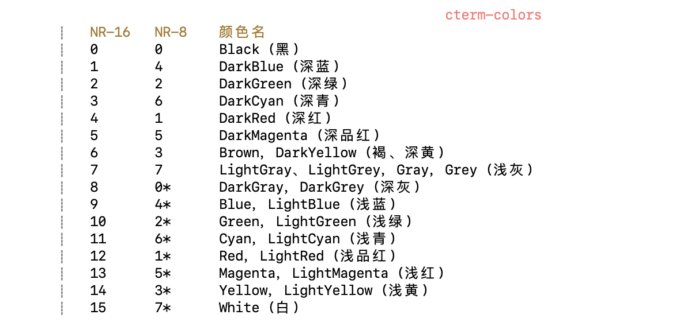
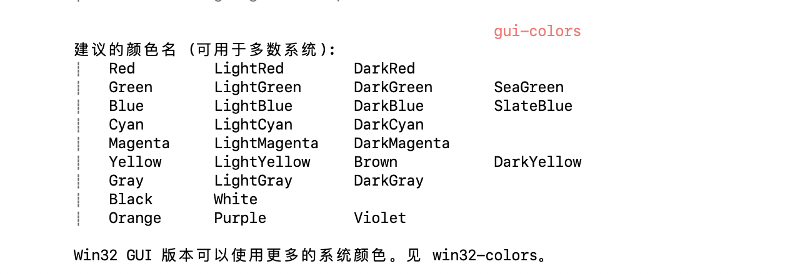
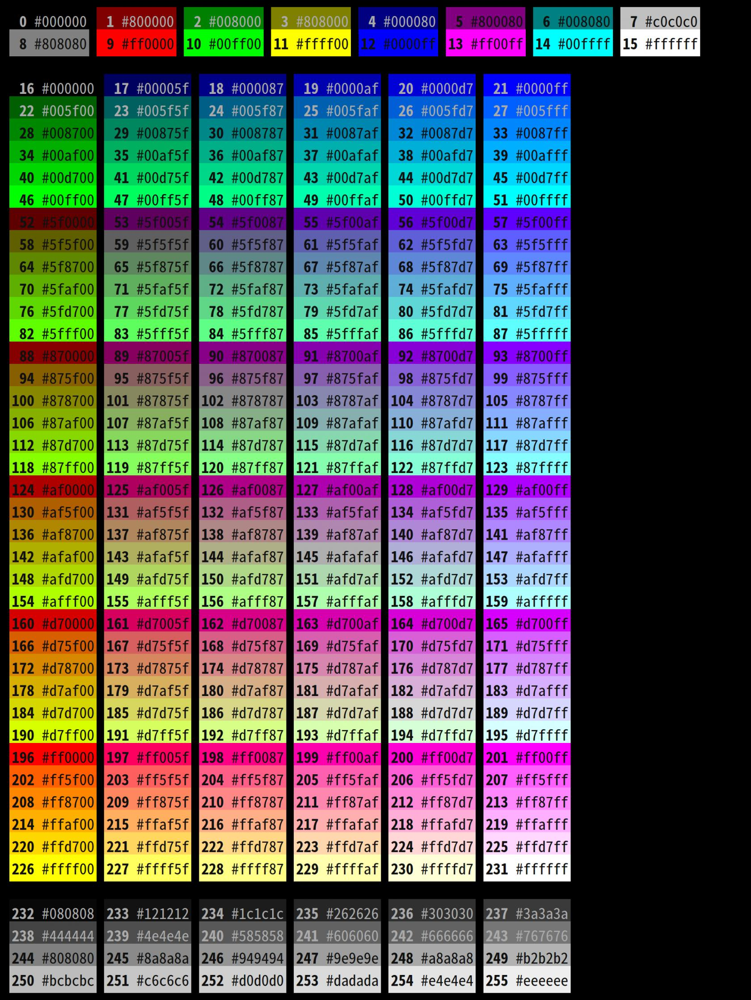

# Mac配置vim颜色

- [改变光标形状](#改变光标形状)
- [参考版](#参考版)
- [自定义xcodelight版](#自定义xcodelight版)
- [vimrc](#vimrc)
- [vimrc_old](#vimrc_old)
- [vim状态栏](#vim状态栏)

------







## 改变光标形状

```bash
"在vimrc中编辑"
"Mode Settings

let &t_SI.="\e[5 q" "SI = INSERT mode
let &t_SR.="\e[4 q" "SR = REPLACE mode
let &t_EI.="\e[1 q" "EI = NORMAL mode (ELSE)

"Cursor settings:

"  1 -> blinking block
"  2 -> solid block
"  3 -> blinking underscore
"  4 -> solid underscore
"  5 -> blinking vertical bar
"  6 -> solid vertical bar


"let &t_SI = "\<Esc>]50;CursorShape=1\x7"
"let &t_SR = "\<Esc>]50;CursorShape=2\x7"
"let &t_EI = "\<Esc>]50;CursorShape=0\x7"
```

## 参考版

```bash
SpecialKey   xxx term=bold ctermfg=81 guifg=Cyan
EndOfBuffer  xxx links to NonText
NonText    xxx term=bold ctermfg=12 gui=bold guifg=Blue
Directory   xxx term=bold ctermfg=10
ErrorMsg    xxx term=standout ctermfg=9
IncSearch   xxx term=reverse ctermfg=11 ctermbg=0
Search     xxx term=reverse ctermfg=0 ctermbg=11 guifg=Black guibg=Yellow
MoreMsg    xxx term=bold ctermfg=121 gui=bold guifg=SeaGreen
ModeMsg    xxx term=bold cterm=bold gui=bold
LineNr     xxx term=underline ctermfg=11 guifg=Yellow
LineNrAbove  xxx cleared
LineNrBelow  xxx cleared
CursorLineNr  xxx term=bold cterm=underline ctermfg=11 gui=bold guifg=Yellow
Question    xxx term=standout ctermfg=121 gui=bold guifg=Green
StatusLine   xxx term=bold,reverse cterm=bold,reverse gui=bold,reverse
StatusLineNC  xxx term=reverse cterm=reverse gui=reverse
VertSplit   xxx term=reverse cterm=reverse gui=reverse
Title     xxx term=bold ctermfg=225 gui=bold guifg=Magenta
Visual     xxx term=reverse ctermbg=242 guibg=DarkGrey
VisualNOS   xxx term=bold,underline cterm=bold,underline gui=bold,underline
WarningMsg   xxx term=standout ctermfg=224 guifg=Red
WildMenu    xxx term=standout ctermfg=0 ctermbg=11 guifg=Black guibg=Yellow
Folded     xxx term=standout ctermfg=10
FoldColumn   xxx term=standout ctermfg=10
DiffAdd    xxx term=bold ctermbg=4 guibg=DarkBlue
DiffChange   xxx term=bold ctermbg=5 guibg=DarkMagenta
DiffDelete   xxx term=bold ctermfg=12 ctermbg=6 gui=bold guifg=Blue guibg=DarkCyan
DiffText    xxx term=reverse cterm=bold ctermbg=9 gui=bold guibg=Red
SignColumn   xxx term=standout ctermfg=14 ctermbg=242 guifg=Cyan guibg=Grey
Conceal    xxx ctermfg=7 ctermbg=242 guifg=LightGrey guibg=DarkGrey
SpellBad    xxx term=reverse ctermbg=9 gui=undercurl guisp=Red
SpellCap    xxx term=reverse ctermbg=12 gui=undercurl guisp=Blue
SpellRare   xxx term=reverse ctermbg=13 gui=undercurl guisp=Magenta
SpellLocal   xxx term=underline ctermbg=14 gui=undercurl guisp=Cyan
Pmenu     xxx ctermfg=0 ctermbg=13 guibg=Magenta
PmenuSel    xxx ctermfg=242 ctermbg=0 guibg=DarkGrey
PmenuSbar   xxx ctermbg=248 guibg=Grey
PmenuThumb   xxx ctermbg=15 guibg=White
TabLine    xxx term=underline cterm=underline ctermfg=15 ctermbg=242 gui=underline guibg=DarkGrey
TabLineSel   xxx term=bold cterm=bold gui=bold
TabLineFill  xxx term=reverse cterm=reverse gui=reverse
CursorColumn  xxx term=reverse
CursorLine   xxx term=underline cterm=underline
ColorColumn  xxx term=reverse ctermfg=9 ctermbg=9
QuickFixLine  xxx links to Search
StatusLineTerm xxx term=bold,reverse cterm=bold ctermfg=0 ctermbg=121 gui=bold guifg=bg guibg=LightGreen
StatusLineTermNC xxx term=reverse ctermfg=0 ctermbg=121 guifg=bg guibg=LightGreen
Normal     xxx guifg=#f0f0f0 guibg=#252c31
MatchParen   xxx term=reverse ctermbg=6 guibg=DarkCyan
ToolbarLine  xxx term=underline ctermbg=242 guibg=Grey50
ToolbarButton xxx cterm=bold ctermfg=0 ctermbg=7 gui=bold guifg=Black guibg=LightGrey
Comment    xxx term=bold ctermfg=240 gui=italic
Constant    xxx term=underline cterm=bold ctermfg=5
Special    xxx term=bold ctermfg=224 guifg=Orange
Identifier   xxx term=underline cterm=bold ctermfg=14 guifg=#40ffff
Statement   xxx term=bold ctermfg=11 gui=bold guifg=#ffff60
PreProc    xxx term=underline ctermfg=81 guifg=#ff80ff
Type      xxx term=underline ctermfg=121 gui=bold guifg=#60ff60
Underlined   xxx term=underline cterm=underline ctermfg=81 gui=underline guifg=#80a0ff
Ignore     xxx ctermfg=0 guifg=bg
Error     xxx term=reverse ctermfg=9
Todo      xxx term=standout ctermfg=0 ctermbg=11 guifg=Blue guibg=Yellow
String     xxx links to Constant
Character   xxx ctermfg=12
Number     xxx links to Constant
Boolean    xxx ctermfg=5
Float     xxx ctermfg=12
Function    xxx ctermfg=45
Conditional  xxx cterm=bold ctermfg=5
Repeat     xxx links to Statement
Label     xxx links to Statement
Operator    xxx links to Statement
Keyword    xxx links to Statement
Exception   xxx cterm=bold ctermfg=5
Include    xxx ctermfg=94
Define     xxx ctermfg=94
Macro     xxx links to PreProc
PreCondit   xxx links to PreProc
StorageClass  xxx links to Type
Structure   xxx links to Type
Typedef    xxx links to Type
Tag      xxx links to Special
SpecialChar  xxx links to Special
Delimiter   xxx ctermfg=0
SpecialComment xxx links to Special
Debug     xxx ctermfg=11 ctermbg=9
Cursor     xxx cterm=reverse ctermfg=14 ctermbg=14
```

## 自定义xcodelight版

```bash
" Vim color file
" create by NickDeCodes (NickDeCodes@163.com)

set background=dark
set t_Co=256
hi clear

if exists("syntax_on")
  syntax reset
endif

let colors_name = "xcodelight"
" 初始化
hi Normal         ctermfg=NONE ctermbg=NONE cterm=NONE guifg=#f0f0f0 guibg=NONE gui=NONE " 普通文本 
hi Boolean        ctermfg=DarkMagenta ctermbg=NONE cterm=NONE guifg=DarkMagenta guibg=NONE gui=NONE " bool值高亮
hi Cursor         ctermfg=NONE ctermbg=NONE cterm=inverse guifg=Cyan guibg=Cyan gui=inverse " 光标所在的字符
hi CursorLine     ctermfg=NONE ctermbg=NONE cterm=underline guifg=NONE guibg=NONE gui=underline " 光标当前行
hi CursorLineNr   ctermfg=Cyan ctermbg=NONE cterm=NONE guifg=Cyan guibg=NONE gui=NONE " 光标当前行
hi CursorColumn   ctermfg=NONE ctermbg=NONE cterm=NONE guifg=NONE guibg=NONE gui=NONE " 光标当前列
hi ColorColumn    ctermfg=Red ctermbg=Red cterm=NONE guifg=Red guibg=Red gui=NONE " 颜色列
hi Character      ctermfg=Blue ctermbg=NONE cterm=NONE guifg=Blue guibg=NONE gui=NONE " 字符高亮
hi Comment        ctermfg=DarkGrey ctermbg=NONE cterm=NONE guifg=DarkGrey guibg=NONE gui=italic " 文件头部声明
hi Constant       ctermfg=DarkMagenta ctermbg=NONE cterm=bold guifg=DarkMagenta guibg=NONE gui=bold " 任何常数
hi Conditional    ctermfg=DarkMagenta ctermbg=NONE cterm=bold guifg=DarkMagenta guibg=NONE gui=bold " if、then、else、endif、switch 等
hi Debug          ctermfg=Yellow ctermbg=Red cterm=NONE guifg=Yellow guibg=Red gui=NONE " 调试语句
hi Define         ctermfg=Brown ctermbg=NONE cterm=NONE guifg=Brown guibg=NONE gui=NONE " 预处理命令 #define
hi Directory      ctermfg=Green ctermbg=NONE cterm=NONE guifg=Green guibg=NONE gui=NONE " 目录名 (还有列表里的其它特殊名字)
hi Delimiter      ctermfg=Black ctermbg=NONE cterm=NONE guifg=Black guibg=NONE gui=NONE " 需要注意的字 分隔符<>
hi DiffAdd        ctermfg=Grey ctermbg=Red cterm=NONE guifg=Grey guibg=Red gui=NONE " diff 模式: 增加的行 |diff.txt|
hi DiffDelete     ctermfg=Red ctermbg=Cyan cterm=NONE guifg=Red guibg=Cyan gui=NONE " diff 模式: 删除的行 |diff.txt|
hi DiffChange     ctermfg=Cyan ctermbg=Cyan cterm=NONE guifg=Cyan guibg=Cyan gui=NONE " diff 模式: 改变的行 |diff.txt|
hi DiffText       ctermfg=Yellow ctermbg=Cyan cterm=NONE guifg=Yellow guibg=Cyan gui=bold " diff 模式: 改变行里的改动文本 |diff.txt|
hi Error          ctermfg=Red ctermbg=NONE cterm=NONE guifg=Red guibg=NONE gui=NONE " 错误左侧>>
hi ErrorMsg       ctermfg=Red ctermbg=NONE cterm=NONE guifg=Red guibg=NONE gui=NONE " 命令行中的错误提示
hi Exception      ctermfg=DarkMagenta ctermbg=NONE cterm=bold guifg=DarkMagenta guibg=NONE gui=bold " try、catch、throw
hi EndOfBuffer    ctermfg=DarkGrey ctermbg=NONE cterm=NONE guifg=DarkGrey guibg=NONE gui=NONE
hi Folded         ctermfg=Green ctermbg=NONE cterm=NONE guifg=Green guibg=NONE gui=NONE " 折叠行高亮 
hi FoldColumn 	  ctermfg=Green ctermbg=NONE cterm=NONE guifg=Green guibg=NONE gui=NONE " 用于关闭的折叠的列
hi Float          ctermfg=Blue ctermbg=NONE cterm=NONE guifg=Blue guibg=NONE gui=NONE " float值高亮
hi Function       ctermfg=Cyan ctermbg=NONE cterm=NONE guifg=Cyan guibg=NONE gui=NONE " 函数名 (也包括: 类的方法名)
hi Include        ctermfg=94 ctermbg=NONE cterm=NONE guifg=#875f00 guibg=NONE gui=NONE " 预处理命令 #include
hi IncSearch      ctermfg=Yellow ctermbg=Black cterm=NONE guifg=Yellow guibg=Black gui=NONE " 高亮；也用于被 ":s///c" 替换的文本
hi Identifier     ctermfg=NONE ctermbg=NONE cterm=NONE guifg=NONE guibg=NONE gui=NONE " 任何变量名
hi Keyword        ctermfg=DarkMagenta ctermbg=NONE cterm=bold guifg=DarkMagenta guibg=NONE gui=bold " 其它关键字
hi LineNr         ctermfg=DarkGrey ctermbg=NONE cterm=NONE guifg=DarkGrey guibg=NONE gui=NONE " 左侧行号
hi Label          ctermfg=DarkMagenta ctermbg=NONE cterm=bold guifg=DarkMagenta guibg=NONE gui=bold " case、default 等
hi Menu           ctermfg=Cyan ctermbg=Grey cterm=NONE guifg=Cyan guibg=Grey gui=NONE " 当前菜单的字体、背景色和前景色。也包括工具栏。可用的高亮参数: font、guibg、guifg。
hi Macro          ctermfg=94 ctermbg=NONE cterm=NONE guifg=#875f00 guibg=NONE gui=NONE " 宏
hi MatchParen     ctermfg=Yellow ctermbg=Black cterm=inverse guifg=Yellow guibg=Black gui=inverse " 括号匹配
hi ModeMsg 		    ctermfg=Cyan ctermbg=NONE cterm=NONE guifg=Cyan guibg=NONE gui=NONE " 模式高亮
hi MoreMsg 		    ctermfg=NONE ctermbg=NONE cterm=NONE guifg=NONE guibg=NONE gui=NONE " 输入栏提示
hi NonText        ctermfg=DarkGrey ctermbg=NONE cterm=NONE guifg=DarkGrey guibg=NONE gui=NONE " 非文本区（控制字符和一些特殊字符和编辑器空白区等）
hi Number         ctermfg=Blue ctermbg=NONE cterm=NONE guifg=Blue guibg=NONE gui=NONE " 数字
hi Operator       ctermfg=DarkMagenta ctermbg=NONE cterm=bold guifg=DarkMagenta guibg=NONE gui=bold " "sizeof"、"+"、"*" 等
hi Pmenu          ctermfg=DarkGrey ctermbg=NONE cterm=NONE guifg=DarkGrey guibg=NONE gui=NONE "弹出菜单: 普通项目 补全提示行 
hi PmenuSel       ctermfg=27 ctermbg=Black cterm=inverse guifg=#005fff guibg=Black gui=inverse " 弹出菜单: 选中项目。 补全光标行
hi PmenuSbar      ctermfg=Red ctermbg=Green cterm=inverse guifg=Red guibg=Green gui=inverse " 弹出菜单: 滚动条
hi PmenuThumb     ctermfg=Cyan ctermbg=Green cterm=inverse guifg=Cyan guibg=Green gui=inverse " 弹出菜单: 滚动条的拇指 (thumb)
hi PreProc        ctermfg=94 ctermbg=NONE cterm=NONE guifg=#875f00 guibg=NONE gui=NONE " 通用预处理命令
hi PreCondit      ctermfg=94 ctermbg=NONE cterm=NONE guifg=#875f00 guibg=NONE gui=NONE " 预处理命令makefile ifneq
hi Question 		  ctermfg=Cyan ctermbg=NONE cterm=NONE guifg=Cyan guibg=NONE gui=bold " |hit-enter| 提示和 yes/no 问补全时下方的提示信息1/5
hi Repeat         ctermfg=DarkMagenta ctermbg=NONE cterm=bold guifg=DarkMagenta guibg=NONE gui=bold " for、do、while 等
hi StatusLine     ctermfg=231 ctermbg=59 cterm=bold guifg=#ffffff guibg=#5f5f5f gui=bold " 当前窗口的状态行
hi StatusLineNC   ctermfg=231 ctermbg=59 cterm=bold guifg=#ffffff guibg=#5f5f5f gui=bold " 非当前窗口的状态行
hi Search         ctermfg=Yellow ctermbg=Black cterm=reverse guifg=Yellow guibg=Black gui=reverse " 查找高亮
hi Special        ctermfg=DarkGrey ctermbg=NONE cterm=NONE guifg=DarkGrey guibg=NONE gui=NONE " python#注释
hi SpecialChar    ctermfg=203 ctermbg=NONE cterm=NONE guifg=#ff5f5f guibg=NONE gui=NONE " %s
hi SpecialKey     ctermfg=NONE ctermbg=NONE cterm=NONE guifg=NONE guibg=NONE gui=NONE " ^[]
hi Statement      ctermfg=DarkMagenta ctermbg=NONE cterm=bold guifg=DarkMagenta guibg=NONE gui=bold " 任何语句
hi StorageClass   ctermfg=DarkMagenta ctermbg=NONE cterm=bold guifg=DarkMagenta guibg=NONE gui=bold " static、register、volatile 等
hi SignColumn     ctermfg=NONE ctermbg=NONE cterm=NONE guifg=NONE guibg=NONE gui=NONE " 显示 |signs| 的列
hi Structure      ctermfg=DarkMagenta ctermbg=NONE cterm=bold guifg=DarkMagenta guibg=NONE gui=bold " struct、union、enum等
hi String         ctermfg=203 ctermbg=NONE cterm=NONE guifg=#ff5f5f guibg=NONE gui=NONE " 字符串
hi SpellBad       term=reverse ctermbg=9 gui=undercurl guisp=Red " 拼写检查器不能识别的单词。|spell|它会和本来应该使用的高亮进行组合
hi SpellCap       term=reverse ctermbg=12 gui=undercurl guisp=Blue " 拼写检查器能识别但只在其它区域使用的单词
hi SpellRare      ctermfg=203 ctermbg=NONE cterm=NONE guifg=#ff5f5f guibg=NONE gui=NONE " 拼写检查器能识别但很少使用的单词
hi Scrollbar      ctermfg=Cyan ctermbg=Grey cterm=NONE guifg=Cyan guibg=Grey gui=NONE " 主窗口滚动条的当前背景和前景色。可用的高亮参数: guibg、guifg。
hi SpecialComment ctermfg=Cyan ctermbg=Blue cterm=NONE guifg=Cyan guibg=Blue gui=NONE " 注释里的特殊部分
hi Tag            ctermfg=Green ctermbg=Blue cterm=NONE guifg=Green guibg=Blue gui=NONE " 可以使用 CTRL-] 的项目
hi Todo           ctermfg=203 ctermbg=NONE cterm=NONE guifg=#ff5f5f guibg=NONE gui=inverse,bold,italic " 需要特殊注意的部分；主要是关键字 TODO FIXME 和 XX
hi Type           ctermfg=DarkMagenta ctermbg=NONE cterm=bold guifg=DarkMagenta guibg=NONE gui=bold " int、void、bool、char等声明语法高亮
hi Title          ctermfg=NONE ctermbg=NONE cterm=NONE guifg=NONE guibg=NONE gui=bold " ":set all"、":autocmd" 等输出的标题 markdown标题
hi Tooltip	      ctermfg=Cyan ctermbg=Grey cterm=NONE guifg=Cyan guibg=Grey gui=NONE " 当前工具提示的字体、背景色和前景色。也包括工具栏。可用的高亮参数: font、guibg、guifg。
hi Typedef        ctermfg=DarkMagenta ctermbg=NONE cterm=bold guifg=DarkMagenta guibg=NONE gui=bold " typedef 定义
hi TabLine        ctermfg=Cyan ctermbg=Grey cterm=NONE guifg=Cyan guibg=Grey gui=NONE " 标签页行，非活动标签页标签
hi TabLineFill    ctermfg=Cyan ctermbg=Grey cterm=NONE guifg=Cyan guibg=Grey gui=NONE " 标签页行，没有标签的地方
hi TabLineSel     ctermfg=Cyan ctermbg=Grey cterm=NONE guifg=Cyan guibg=Grey gui=NONE " 标签页行，活动标签页标签
hi Underlined     ctermfg=Cyan ctermbg=Grey cterm=NONE guifg=Cyan guibg=Grey gui=NONE " 需要突出的文本，HTML 链接
hi Visual         ctermfg=NONE ctermbg=LightCyan cterm=NONE guifg=NONE guibg=LightCyan gui=NONE " 可视模式的选择区
hi VertSplit      ctermfg=NONE ctermbg=Grey cterm=NONE guifg=NONE guibg=Grey gui=NONE " 分离垂直分割窗口的列
hi VisualNOS      ctermfg=Yellow ctermbg=Grey cterm=NONE guifg=Yellow guibg=Grey gui=NONE " Vim 是 "选择区的非拥有者" 时，可视模式的选择区
hi WildMenu 		  ctermfg=Blue ctermbg=Grey cterm=NONE guifg=Blue guibg=Grey gui=NONE " 'wildmenu' 补全的当前匹配
hi WarningMsg     ctermfg=Yellow ctermbg=NONE cterm=NONE guifg=Yellow guibg=NONE gui=NONE " 命令行中的警告提示
```

## vimrc

```bash
" Copyright 2021 NickDeCodes
" ======================================================== pack configuration =======================================================
" 自动括号补全
packadd auto-pairs 
" 显示项目树
packadd nerdtree 
" 美观的状态栏
packadd vim-airline 
" 状态栏主题
packadd vim-airline-themes 
let g:airline_theme='kolor'
" 剪贴板捕获
packadd CaptureClipboard 
let g:CaptureClipboard_DefaultDelimiter = "\n"
let g:CaptureClipboard_EndOfCaptureMarker = '.'
let g:CaptureClipboard_IsAutoSave = 1
let g:CaptureClipboard_Register = '+'
imap <C-R>? <Plug>(CaptureClipboardInsertOne)
" 语法检查
packadd syntastic 
set statusline+=%#warningmsg#
set statusline+=%{SyntasticStatuslineFlag()}
set statusline+=%*
let g:syntastic_cpp_compiler = 'clang++'
let g:syntastic_cpp_compiler_options = ' -std=c++11 -stdlib=libc++'
let g:syntastic_always_populate_loc_list = 1
let g:syntastic_auto_loc_list = 1
let g:syntastic_check_on_open = 0
let g:syntastic_check_on_wq = 0
" 自动补全
packadd youcompleteme
" ======================================================== view configuration ======================================================
" ---------------------------syntax configuration----------------------------
syntax on " 语法高亮开启
" ---------------------------help configuration------------------------------
" 显示中文帮助
if v:version >= 704
	set helplang=cn
	set encoding=utf-8
endif
set langmenu=zh_CN.UTF-8 " 语言设置
" ------------------------alignment configuration----------------------------
set shiftwidth=4 " 自动缩进的时候，缩进尺寸为4个空格
set tabstop=4 " Tab宽度为4个字符
set softtabstop=4 " 统一缩进为4
set expandtab " 使用空格代替制表符
set smarttab " 删除Tab一键delete
set smartindent " 智能对齐
set autoindent " 自动缩进
set cindent
set linebreak " 数字加空格
set wildmenu " 在命令模式下使用 Tab 自动补全的时候，将补全内容使用一个漂亮的单行菜单形式显示出来
set fo+=mB " 打开断行模块对亚洲语言支持。m 表示允许在两个汉字之间断行，即使汉字之间没有出现空格。B 表示将两行合并为一行的时候，汉字与汉字之间不要补空格。
set scrolloff=3 " 光标移动到buffer的顶部和底部时保持3行距离 
set completeopt=preview,menu " 代码补全 
set completeopt=longest,menu " 打开文件类型检测, 加了这句才可以用智能补全
" ------------------------highlinght configuration---------------------------
set cursorline " 高亮光标所在行
set cursorcolumn " 高亮光标所在列
"autocmd InsertLeave * se nocul " 不用浅色高亮当前行  
autocmd InsertEnter * se cursorline " 用浅色高亮当前行 
set hlsearch " 搜索逐字符高亮
set incsearch " 显示查找的匹配点
set showmatch " 高亮显示匹配的括号
set matchtime=1 " 匹配括号高亮的时间（单位是十分之一秒
" ------------------------status bar configuration---------------------------
set cmdheight=2 " 总是显示状态行
set laststatus=2 " 启动显示状态行(1),总是显示状态行(2)  
set guioptions-=T " 隐藏工具栏
set guioptions-=m " 隐藏菜单栏
set mousemodel=popup " 当右键单击窗口的时候，弹出快捷菜单
set shortmess=atI " 启动的时候不显示那个援助乌干达儿童的提示 
set statusline=%F%m%r%h%w\ [FORMAT=%{&ff}]\ [TYPE=%Y]\ [POS=%l,%v][%p%%]\ %{strftime(\"%d/%m/%y\ -\ %H:%M\")} " 状态行显示的内容
" --------------------------schemes configuration----------------------------
color xcodelight " 设置xcodelight背景主题  
"color xcodedark " 设置xcodedark背景主题
" ---------------------------other configuration-----------=-----------------
set ruler " 显示标尺  
set showcmd " 输入的命令显示出来，看的清楚些
set nocompatible " 不要使用vi的键盘模式，而是vim自己的
set number " 显示行号
set history=1000 " 历史记录数
set viminfo+=! " 保存全局变量
set iskeyword+=_,$,@,%,#,- " 带有如下符号的单词不要被换行分割
" 字符间插入的像素行数目
if has("autocmd")
  	autocmd BufReadPost * if line("'\"") > 0 && line("'\"") <= line("$") | exe "normal g`\"" | endif
endif
" 当打开vim且没有文件时自动打开NERDTree
" autocmd vimenter * if !argc() | NERDTree | endif
" 只剩 NERDTree时自动关闭
" autocmd bufenter * if (winnr("$") == 1 && exists("b:NERDTreeType") && b:NERDTreeType == "primary") | q | endif
set autoread " 设置当文件被改动时自动载入
autocmd FileType c,cpp map <buffer> <leader><space> :w<cr>:make<cr> " quickfix模式
set autowrite " 自动保存
set magic " 设置魔术
set noeb " 去掉输入错误的提示声音
set confirm " 在处理未保存或只读文件的时候，弹出确认
set nobackup " 禁止生成临时文件
set noswapfile
set ignorecase " 搜索忽略大小写
set linespace=0
set backspace=2 " 使回格键（backspace）正常处理indent, eol, start等
set mouse=a " 可以在buffer的任何地方使用鼠标（类似office中在工作区双击鼠标定位）__
set selectmode=mouse,key
set report=0 " 通过使用: commands命令，告诉我们文件的哪一行被改变过
set fillchars=vert:\ ,stl:\ ,stlnc:\ " 在被分割的窗口间显示空白，便于阅读
set fileformat=unix " 从Win上复制文件时，避免换行符错误
" ======================================================== file configuration ======================================================
" ------------------------file type configuration----------------------------
filetype on " 侦测文件类型
filetype plugin on " 载入文件类型插件
filetype indent on " 为特定文件类型载入相关缩进文件
filetype plugin indent on " Automatically detect file types.
autocmd FileType php setlocal dict+=~/.vim/dict/php_funclist.dict
autocmd FileType css setlocal dict+=~/.vim/dict/css.dict
autocmd FileType c setlocal dict+=~/.vim/dict/c.dict
autocmd FileType cpp setlocal dict+=~/.vim/dict/cpp.dict
autocmd FileType scale setlocal dict+=~/.vim/dict/scale.dict
autocmd FileType javascript setlocal dict+=~/.vim/dict/javascript.dict
autocmd FileType html setlocal dict+=~/.vim/dict/ftdetectjavascript.dict
autocmd FileType html setlocal dict+=~/.vim/dict/css.dict
" ----------------------new file titles configuration------------------------
" 新建.c,.h,.sh,.java文件，自动插入文件头 
autocmd BufNewFile *.cpp,*.[ch],*.sh,*.rb,*.java,*.py exec ":call SetTitle()" 
" 定义函数SetTitle，自动插入文件头 
function SetTitle() 
	"如果文件类型为.sh文件 
	if &filetype == 'sh' 
		call setline(1,"\#!/bin/bash") 
		call append(line("."), "") 
    elseif &filetype == 'python'
        call setline(1,"#!/usr/bin/env python")
        call append(line("."),"# coding=utf-8")
	    call append(line(".")+1, "") 
    elseif &filetype == 'ruby'
        call setline(1,"#!/usr/bin/env ruby")
        call append(line("."),"# encoding: utf-8")
	    call append(line(".")+1, "")
    elseif &filetype == 'md'
        call setline(1,"<head><meta charset=\"UTF-8\"></head>")
	else 
		call setline(1, "/*************************************************************************") 
		call append(line("."), "	> File Name: ".expand("%")) 
		call append(line(".")+1, "	> Author: ") 
		call append(line(".")+2, "	> Mail: ") 
		call append(line(".")+3, "	> Created Time: ".strftime("%c")) 
		call append(line(".")+4, " ************************************************************************/") 
		call append(line(".")+5, "")
	endif
	if expand("%:e") == 'cpp'
		call append(line(".")+6, "#include <iostream>")
		call append(line(".")+7, "using namespace std;")
		call append(line(".")+8, "")
	endif
	if &filetype == 'c'
		call append(line(".")+6, "#include <stdio.h>")
		call append(line(".")+7, "")
	endif
	if expand("%:e") == 'h'
		call append(line(".")+6, "#ifndef _".toupper(expand("%:r"))."_H")
		call append(line(".")+7, "#define _".toupper(expand("%:r"))."_H")
		call append(line(".")+8, "#endif")
	endif
	if &filetype == 'java'
		call append(line(".")+6,"public class ".expand("%:r"))
		call append(line(".")+7,"")
	endif
	"新建文件后，自动定位到文件末尾
endfunction 
autocmd BufNewFile * normal G
" ---------------------------markdown configuration--------------------------
autocmd BufRead,BufNewFile *.{md,mdown,mkd,mkdn,markdown,mdwn} set filetype=mkd
autocmd BufRead,BufNewFile *.{go} set filetype=go
autocmd BufRead,BufNewFile *.{js} set filetype=javascript
" markdown to HTML  
nmap md :!~/.vim/markdown.pl % > %.html <CR><CR>
nmap fi :!chrome %.html & <CR><CR>
nmap \ \cc
vmap \ \cc
" 将tab替换为空格
nmap tt :%s/\t/    /g<CR>
" ======================================================== keyboard configuration ======================================================
" ------------------------F2 compiler configuration--------------------------
nnoremap <F2> :g/^\s*$/d<CR> " 去空行  
nnoremap <C-F2> :vert diffsplit " 比较文件
" ------------------------F3 compiler configuration--------------------------
map <F3> :NERDTreeToggle<CR> " 列出当前目录文件
let NERDTreeChDirMode=1
let NERDTreeShowBookmarks=1 " 显示书签
let NERDTreeIgnore=['\~$', '\.pyc$', '\.swp$'] " 设置忽略文件类型
let NERDTreeWinSize=25 " 窗口大小
" 当打开vim且没有文件时自动打开NERDTree
autocmd StdinReadPre * let s:std_in=1
autocmd VimEnter * if argc() == 0 && !exists('s:std_in') | NERDTree | endif
" 只剩 NERDTree时自动关闭
autocmd BufEnter * if tabpagenr('$') == 1 && winnr('$') == 1 && exists('b:NERDTree') && b:NERDTree.isTabTree() | quit | endif
" ------------------------F4 compiler configuration--------------------------
" ------------------------F5 compiler configuration--------------------------
map <F5> :call CompileRunGcc()<CR>
function! CompileRunGcc()
	exec "w"
	if &filetype == 'c'
		exec "!gcc % -o %<"
		exec "!time ./%<"
	elseif &filetype == 'cpp'
		exec "!g++ % -std=c++11 -o %<"
		exec "!time ./%<"
	elseif &filetype == 'java' 
		exec "!javac %" 
		exec "!time java %<"
	elseif &filetype == 'sh'
		:!time bash %
	elseif &filetype == 'python'
		exec "!time python2.7 %"
    elseif &filetype == 'html'
        exec "!firefox % &"
    elseif &filetype == 'go'
    "    exec "!go build %<"
        exec "!time go run %"
    elseif &filetype == 'mkd'
        exec "!~/.vim/markdown.pl % > %.html &"
        exec "!firefox %.html &"
	endif
endfunction
" -------------------------F6 formart configuration--------------------------
map <F6> :call FormartSrc()<CR><CR>
function FormartSrc()
    exec "w"
    if &filetype == 'c'
        exec "!astyle --style=ansi -a --suffix=none %"
    elseif &filetype == 'cpp' || &filetype == 'hpp'
        exec "r !astyle --style=ansi --one-line=keep-statements -a --suffix=none %> /dev/null 2>&1"
    elseif &filetype == 'perl'
        exec "!astyle --style=gnu --suffix=none %"
    elseif &filetype == 'py'||&filetype == 'python'
        exec "r !autopep8 -i --aggressive %"
    elseif &filetype == 'java'
        exec "!astyle --style=java --suffix=none %"
    elseif &filetype == 'jsp'
        exec "!astyle --style=gnu --suffix=none %"
    elseif &filetype == 'xml'
        exec "!astyle --style=gnu --suffix=none %"
    else
        exec "normal gg=G"
        return
    endif
    exec "e! %"
endfunction
" ------------------------F7 configuration--------------------------
" ---------------------------F8 gdb configuration----------------------------
map <F8> :call Rungdb()<CR>
function! Rungdb()
	exec "w"
	exec "!g++ % -std=c++11 -g -o %<"
	exec "!gdb ./%<"
endfunction
" ---------------------------------------------------------------------------
:nmap <silent> <F9> <ESC>:Tlist<RETURN>
map <F12> gg=G
" ======================================================== keyboard configuration ======================================================
let mapleader="," " 设置 leader
let g:mapleader = ','
" 分屏窗口移动, Smart way to move between windows
map <C-j> <C-W>j
map <C-k> <C-W>k
map <C-h> <C-W>h
map <C-l> <C-W>l
" 命令行模式增强，ctrl - a到行首， -e 到行尾
cnoremap <C-a> <Home>
cnoremap <C-e> <End>
" Esc + 保存
map <Esc><Esc> :w<CR>
" 选中状态下 Ctrl+c 复制
imap <C-v> <Esc>"*pa
imap <C-a> <Esc>^
imap <C-e> <Esc>$
vmap <C-c> "+y
" ======================================================== tags configuration ======================================================
" ---------------------------CTags configuration-----------------------------
let Tlist_Sort_Type = "name" " 按照名称排序  
let Tlist_Use_Right_Window = 1 " 在右侧显示窗口  
let Tlist_Compart_Format = 1 " 压缩方式  
let Tlist_Exist_OnlyWindow = 1 " 如果只有一个buffer，kill窗口也kill掉buffer  
" let Tlist_File_Fold_Auto_Close = 0 " 不要关闭其他文件的tags  
" let Tlist_Enable_Fold_Column = 0 " 不要显示折叠树  
" let Tlist_Show_One_File=1 " 不同时显示多个文件的tag，只显示当前文件的
" 设置tags  
set tags=tags;  
set autochdir 
let Tlist_Auto_Open=0 " 默认打开Taglist
" --------------------------Tag list configuration---------------------------
let Tlist_Ctags_Cmd = '/usr/local/bin/ctags' 
let Tlist_Show_One_File = 1 " 不同时显示多个文件的tag，只显示当前文件的 
let Tlist_File_Fold_Auto_Close = 1
let Tlist_Exit_OnlyWindow = 1 " 如果taglist窗口是最后一个窗口，则退出vim 
let Tlist_Use_Right_Window = 1 " 在右侧窗口中显示taglist窗口
" minibufexpl插件的一般设置
let g:miniBufExplMapWindowNavVim = 1
let g:miniBufExplMapWindowNavArrows = 1
let g:miniBufExplMapCTabSwitchBufs = 1
let g:miniBufExplModSelTarget = 1  
nmap tl :Tlist<cr>
" python补全
let g:pydiction_location = '~/.vim/after/complete-dict'
let g:pydiction_menu_height = 20
let Tlist_Ctags_Cmd='/usr/local/bin/ctags'
let g:miniBufExplMapWindowNavVim = 1
let g:miniBufExplMapWindowNavArrows = 1
let g:miniBufExplMapCTabSwitchBufs = 1
let g:miniBufExplModSelTarget = 1

set iskeyword+=.
set termencoding=utf-8
set encoding=utf8
set fileencodings=utf8,ucs-bom,gbk,cp936,gb2312,gb18030

autocmd FileType python set omnifunc=pythoncomplete#Complete

let g:html_indent_inctags = "html,body,head,tbody"
let g:html_indent_script1 = "inc"
let g:html_indent_style1 = "inc"
" ---------------------------ctrlp configuration-----------------------------
set wildignore+=*/tmp/*,*.so,*.swp,*.zip,*.pyc,*.png,*.jpg,*.gif " MacOSX/Linux
set wildignore+=*\\tmp\\*,*.swp,*.zip,*.exe,*.pyc,*.png,*.jpg,*.gif " Windows

let g:ctrlp_custom_ignore = '\v[\/]\.(git|hg|svn)$'
let g:ctrlp_custom_ignore = '\v\.(exe|so|dll)$'
let g:ctrlp_extensions = ['funky']
let NERDTreeIgnore=['\.pyc']
```

## vimrc_old

```bash
set sw=4
set ts=4
set et
set smarttab
set smartindent
set lbr
set fo+=mB
set sm
set selection=inclusive
set wildmenu
set mousemodel=popup

au FileType php setlocal dict+=~/.vim/dict/php_funclist.dict
au FileType css setlocal dict+=~/.vim/dict/css.dict
au FileType c setlocal dict+=~/.vim/dict/c.dict
au FileType cpp setlocal dict+=~/.vim/dict/cpp.dict
au FileType scale setlocal dict+=~/.vim/dict/scale.dict
au FileType javascript setlocal dict+=~/.vim/dict/javascript.dict
au FileType html setlocal dict+=~/.vim/dict/javascript.dict
au FileType html setlocal dict+=~/.vim/dict/css.dict

"
"syntastic相关
execute pathogen#infect()
let g:syntastic_python_checkers=['pylint']
let g:syntastic_php_checkers=['php', 'phpcs', 'phpmd']
"golang
"Processing... % (ctrl+c to stop)
let g:fencview_autodetect=0
set rtp+=$GOROOT/misc/vim
"""""""""""""""""""""""""""""""""""""""""""""""""""""""""""""""""""""""""""""""""""""""
" 显示相关  
""""""""""""""""""""""""""""""""""""""""""""""""""""""""""""""""""""""""""""""""""""""""""
syntax on
set cul "高亮光标所在行
set cuc
set shortmess=atI   " 启动的时候不显示那个援助乌干达儿童的提示  
set go=             " 不要图形按钮  
color xcodelight     " 设置xcodelight背景主题  
"color xcodedark     " 设置xcodedark背景主题  
"color ron     " 设置背景主题  
"set guifont=Courier_New:h10:cANSI   " 设置字体  
"autocmd InsertLeave * se nocul  " 用浅色高亮当前行  
autocmd InsertEnter * se cul    " 用浅色高亮当前行  
set ruler           " 显示标尺  
set showcmd         " 输入的命令显示出来，看的清楚些  
"set whichwrap+=<,>,h,l   " 允许backspace和光标键跨越行边界(不建议)  
set scrolloff=3     " 光标移动到buffer的顶部和底部时保持3行距离  
set statusline=%F%m%r%h%w\ [FORMAT=%{&ff}]\ [TYPE=%Y]\ [POS=%l,%v][%p%%]\ %{strftime(\"%d/%m/%y\ -\ %H:%M\")}   "状态行显示的内容  
set laststatus=2    " 启动显示状态行(1),总是显示状态行(2)  
"set foldenable      " 允许折叠  
""set foldmethod=manual   " 手动折叠  
set nocompatible  "去掉讨厌的有关vi一致性模式，避免以前版本的一些bug和局限  
" 显示中文帮助
if version >= 603
	set helplang=cn
	set encoding=utf-8
endif
" 自动缩进
set autoindent
set cindent
" Tab键的宽度
set tabstop=4
" 统一缩进为4
set softtabstop=4
set shiftwidth=4
" 使用空格代替制表符
set expandtab
" 在行和段开始处使用制表符
set smarttab
" 显示行号
set number
" 历史记录数
set history=1000
"搜索逐字符高亮
set hlsearch
set incsearch
"语言设置
set langmenu=zh_CN.UTF-8
set helplang=cn
" 总是显示状态行
set cmdheight=2
" 侦测文件类型
filetype on
" 载入文件类型插件
filetype plugin on
" 为特定文件类型载入相关缩进文件
filetype indent on
" 保存全局变量
set viminfo+=!
" 带有如下符号的单词不要被换行分割
set iskeyword+=_,$,@,%,#,-
" 字符间插入的像素行数目

"markdown配置
au BufRead,BufNewFile *.{md,mdown,mkd,mkdn,markdown,mdwn}   set filetype=mkd
au BufRead,BufNewFile *.{go}   set filetype=go
au BufRead,BufNewFile *.{js}   set filetype=javascript
"rkdown to HTML  
nmap md :!~/.vim/markdown.pl % > %.html <CR><CR>
nmap fi :!firefox %.html & <CR><CR>
nmap \ \cc
vmap \ \cc

"将tab替换为空格
nmap tt :%s/\t/    /g<CR>


"""""""""""""""""""""""""""""""""""""""""""""""""""""""""""""""""""""""""""""""""""""""""""""""""
"""""新文件标题
""""""""""""""""""""""""""""""""""""""""""""""""""""""""""""""""""""""""""""""""""""""""""""""""
"新建.c,.h,.sh,.java文件，自动插入文件头 
autocmd BufNewFile *.cpp,*.[ch],*.sh,*.rb,*.java,*.py exec ":call SetTitle()" 
""定义函数SetTitle，自动插入文件头 
func SetTitle() 
	"如果文件类型为.sh文件 
	if &filetype == 'sh' 
		call setline(1,"\#!/bin/bash") 
		call append(line("."), "") 
    elseif &filetype == 'python'
        call setline(1,"#!/usr/bin/env python")
        call append(line("."),"# coding=utf-8")
	    call append(line(".")+1, "") 

    elseif &filetype == 'ruby'
        call setline(1,"#!/usr/bin/env ruby")
        call append(line("."),"# encoding: utf-8")
	    call append(line(".")+1, "")

"    elseif &filetype == 'mkd'
"        call setline(1,"<head><meta charset=\"UTF-8\"></head>")
	else 
		call setline(1, "/*************************************************************************") 
		call append(line("."), "	> File Name: ".expand("%")) 
		call append(line(".")+1, "	> Author: ") 
		call append(line(".")+2, "	> Mail: ") 
		call append(line(".")+3, "	> Created Time: ".strftime("%c")) 
		call append(line(".")+4, " ************************************************************************/") 
		call append(line(".")+5, "")
	endif
	if expand("%:e") == 'cpp'
		call append(line(".")+6, "#include <iostream>")
		call append(line(".")+7, "using namespace std;")
		call append(line(".")+8, "")
	endif
	if &filetype == 'c'
		call append(line(".")+6, "#include <stdio.h>")
		call append(line(".")+7, "")
	endif
	if expand("%:e") == 'h'
		call append(line(".")+6, "#ifndef _".toupper(expand("%:r"))."_H")
		call append(line(".")+7, "#define _".toupper(expand("%:r"))."_H")
		call append(line(".")+8, "#endif")
	endif
	if &filetype == 'java'
		call append(line(".")+6,"public class ".expand("%:r"))
		call append(line(".")+7,"")
	endif
	"新建文件后，自动定位到文件末尾
endfunc 
autocmd BufNewFile * normal G


""""""""""""""""""""""""""""""""""""""""""""""""""""""""""""""""""""""""""""""""""""""""""""""""""""""
"键盘命令
""""""""""""""""""""""""""""""""""""""""""""""""""""""""""""""""""""""""""""""""""""""""""""""""""""""
:nmap <silent> <F9> <ESC>:Tlist<RETURN>
" shift tab pages
map <S-Left> :tabp<CR>
map <S-Right> :tabn<CR>
map! <C-Z> <Esc>zzi
map! <C-O> <C-Y>,
map <C-A> ggVG$"+y
map <Esc><Esc> :w<CR>
map <F12> gg=G
map <C-w> <C-w>w
imap <C-k> <C-y>,
imap <C-t> <C-q><TAB>
imap <C-j> <ESC>
" 选中状态下 Ctrl+c 复制
"map <C-v> "*pa
imap <C-v> <Esc>"*pa
imap <C-a> <Esc>^
imap <C-e> <Esc>$
vmap <C-c> "+y
set mouse=v
"set clipboard=unnamed
"去空行  
nnoremap <F2> :g/^\s*$/d<CR> 
"比较文件  
nnoremap <C-F2> :vert diffsplit 
"nnoremap <Leader>fu :CtrlPFunky<Cr>
"nnoremap <C-n> :CtrlPFunky<Cr>
"列出当前目录文件  
map <F3> :NERDTreeToggle<CR>
imap <F3> <ESC> :NERDTreeToggle<CR>
"打开树状文件目录  
map <C-F3> \be  
:autocmd BufRead,BufNewFile *.dot map <F5> :w<CR>:!dot -Tjpg -o %<.jpg % && eog %<.jpg  <CR><CR> && exec "redr!"
"C，C++ 按F5编译运行
map <F5> :call CompileRunGcc()<CR>
func! CompileRunGcc()
	exec "w"
	if &filetype == 'c'
		exec "!g++ % -o %<"
		exec "!time ./%<"
	elseif &filetype == 'cpp'
		exec "!g++ % -std=c++11 -o %<"
		exec "!time ./%<"
	elseif &filetype == 'java' 
		exec "!javac %" 
		exec "!time java %<"
	elseif &filetype == 'sh'
		:!time bash %
	elseif &filetype == 'python'
		exec "!time python2.7 %"
    elseif &filetype == 'html'
        exec "!firefox % &"
    elseif &filetype == 'go'
"        exec "!go build %<"
        exec "!time go run %"
    elseif &filetype == 'mkd'
        exec "!~/.vim/markdown.pl % > %.html &"
        exec "!firefox %.html &"
	endif
endfunc
"C,C++的调试
map <F8> :call Rungdb()<CR>
func! Rungdb()
	exec "w"
	exec "!g++ % -std=c++11 -g -o %<"
	exec "!gdb ./%<"
endfunc


"代码格式优化化

map <F6> :call FormartSrc()<CR><CR>

"定义FormartSrc()
func FormartSrc()
    exec "w"
    if &filetype == 'c'
        exec "!astyle --style=ansi -a --suffix=none %"
    elseif &filetype == 'cpp' || &filetype == 'hpp'
        exec "r !astyle --style=ansi --one-line=keep-statements -a --suffix=none %> /dev/null 2>&1"
    elseif &filetype == 'perl'
        exec "!astyle --style=gnu --suffix=none %"
    elseif &filetype == 'py'||&filetype == 'python'
        exec "r !autopep8 -i --aggressive %"
    elseif &filetype == 'java'
        exec "!astyle --style=java --suffix=none %"
    elseif &filetype == 'jsp'
        exec "!astyle --style=gnu --suffix=none %"
    elseif &filetype == 'xml'
        exec "!astyle --style=gnu --suffix=none %"
    else
        exec "normal gg=G"
        return
    endif
    exec "e! %"
endfunc
"结束定义FormartSrc


""""""""""""""""""""""""""""""""""""""""""""""""""""""""""""""""""""""""""""""""""""""""""""""""""""""
""实用设置
"""""""""""""""""""""""""""""""""""""""""""""""""""""""""""""""""""""""""""""""""""""""""""""""""""""
if has("autocmd")
      autocmd BufReadPost *
          \ if line("'\"") > 0 && line("'\"") <= line("$") |
          \   exe "normal g`\"" |
          \ endif
endif
"当打开vim且没有文件时自动打开NERDTree
autocmd vimenter * if !argc() | NERDTree | endif
" 只剩 NERDTree时自动关闭
autocmd bufenter * if (winnr("$") == 1 && exists("b:NERDTreeType") && b:NERDTreeType == "primary") | q | endif

" 设置当文件被改动时自动载入
set autoread
" quickfix模式
autocmd FileType c,cpp map <buffer> <leader><space> :w<cr>:make<cr>
"代码补全 
set completeopt=preview,menu 
"允许插件  
"filetype plugin on
"共享剪贴板  
"set clipboard+=unnamed 
"自动保存
set autowrite
"set ruler                   " 打开状态栏标尺
"set cursorline              " 突出显示当前行
set magic                   " 设置魔术
set guioptions-=T           " 隐藏工具栏
set guioptions-=m           " 隐藏菜单栏
""set foldcolumn=0
""set foldmethod=indent 
""set foldlevel=3 
" 不要使用vi的键盘模式，而是vim自己的
set nocompatible
" 去掉输入错误的提示声音
set noeb
" 在处理未保存或只读文件的时候，弹出确认
set confirm
"禁止生成临时文件
set nobackup
set noswapfile
"搜索忽略大小写
set ignorecase


set linespace=0
" 增强模式中的命令行自动完成操作
set wildmenu
" 使回格键（backspace）正常处理indent, eol, start等
set backspace=2
" 允许backspace和光标键跨越行边界
set whichwrap+=<,>,h,l
" 可以在buffer的任何地方使用鼠标（类似office中在工作区双击鼠标定位）
set mouse=a
set selection=exclusive
set selectmode=mouse,key
" 通过使用: commands命令，告诉我们文件的哪一行被改变过
set report=0
" 在被分割的窗口间显示空白，便于阅读
set fillchars=vert:\ ,stl:\ ,stlnc:\
" 高亮显示匹配的括号
set showmatch
" 匹配括号高亮的时间（单位是十分之一秒）
set matchtime=1
" 光标移动到buffer的顶部和底部时保持3行距离
set scrolloff=3
" 为C程序提供自动缩进
"自动补全
"":inoremap ( ()<ESC>i
"":inoremap ) <c-r>=ClosePair(')')<CR>
":inoremap { {<CR>}<ESC>O
":inoremap } <c-r>=ClosePair('}')<CR>
"":inoremap [ []<ESC>i
"":inoremap ] <c-r>=ClosePair(']')<CR>
"":inoremap " ""<ESC>i
"":inoremap ' ''<ESC>i
""function! ClosePair(char)
""	if getline('.')[col('.') - 1] == a:char
""		return "\<Right>"
""	else
""		return a:char
""	endif
""endfunction
filetype plugin indent on 
"打开文件类型检测, 加了这句才可以用智能补全
set completeopt=longest,menu
"""""""""""""""""""""""""""""""""""""""""""""""""""""""""""""""""""""""""""""""""""""""""""""""""
" CTags的设定  
"""""""""""""""""""""""""""""""""""""""""""""""""""""""""""""""""""""""""""""""""""""""""""""""""
let Tlist_Sort_Type = "name"    " 按照名称排序  
let Tlist_Use_Right_Window = 1  " 在右侧显示窗口  
let Tlist_Compart_Format = 1    " 压缩方式  
let Tlist_Exist_OnlyWindow = 1  " 如果只有一个buffer，kill窗口也kill掉buffer  
""let Tlist_File_Fold_Auto_Close = 0  " 不要关闭其他文件的tags  
""let Tlist_Enable_Fold_Column = 0    " 不要显示折叠树  
"let Tlist_Show_One_File=1            "不同时显示多个文件的tag，只显示当前文件的
"设置tags  
set tags=tags;  
set autochdir 


""""""""""""""""""""""""""""""""""""""""""""""""""""""""""""""""""""""""""""""""""""""""""""""""""""""""""""""""""
"其他东东
"""""""""""""""""""""""""""""""""""""""""""""""""""""""""""""""""""""""""""""""""""""""""""""""""""""""""""""""""
"默认打开Taglist 
let Tlist_Auto_Open=0 
"""""""""""""""""""""""""""""" 
" Tag list (ctags) 
"""""""""""""""""""""""""""""""" 
let Tlist_Ctags_Cmd = '/usr/local/bin/ctags' 
let Tlist_Show_One_File = 1 "不同时显示多个文件的tag，只显示当前文件的 
let Tlist_File_Fold_Auto_Close = 1
let Tlist_Exit_OnlyWindow = 1 "如果taglist窗口是最后一个窗口，则退出vim 
let Tlist_Use_Right_Window = 1 "在右侧窗口中显示taglist窗口
" minibufexpl插件的一般设置
let g:miniBufExplMapWindowNavVim = 1
let g:miniBufExplMapWindowNavArrows = 1
let g:miniBufExplMapCTabSwitchBufs = 1
let g:miniBufExplModSelTarget = 1  
nmap tl :Tlist<cr>

"python补全
let g:pydiction_location = '~/.vim/after/complete-dict'
let g:pydiction_menu_height = 20
let Tlist_Ctags_Cmd='/usr/local/bin/ctags'
let g:miniBufExplMapWindowNavVim = 1
let g:miniBufExplMapWindowNavArrows = 1
let g:miniBufExplMapCTabSwitchBufs = 1
let g:miniBufExplModSelTarget = 1


set iskeyword+=.
set termencoding=utf-8
set encoding=utf8
set fileencodings=utf8,ucs-bom,gbk,cp936,gb2312,gb18030

autocmd FileType python set omnifunc=pythoncomplete#Complete

"set nocompatible               " be iMproved
"filetype off                   " required!

set rtp+=~/.vim/bundle/vundle/
call vundle#rc()

" let Vundle manage Vundle
" required! 
Bundle 'gmarik/vundle'

" My Bundles here:
"
" original repos on github
Bundle 'tpope/vim-fugitive'
Bundle 'rstacruz/sparkup', {'rtp': 'vim/'}
Bundle 'Yggdroot/indentLine'
let g:indentLine_char = '┊'
"ndle 'tpope/vim-rails.git'
" vim-scripts repos
Bundle 'L9'
Bundle 'FuzzyFinder'
" non github repos
Bundle 'https://github.com/wincent/command-t.git'
Bundle 'Auto-Pairs'
Bundle 'python-imports.vim'
Bundle 'CaptureClipboard'
Bundle 'ctrlp-modified.vim'
Bundle 'last_edit_marker.vim'
Bundle 'synmark.vim'
"Bundle 'Python-mode-klen'
Bundle 'SQLComplete.vim'
Bundle 'Javascript-OmniCompletion-with-YUI-and-j'
"Bundle 'JavaScript-Indent'
"Bundle 'Better-Javascript-Indentation'
Bundle 'jslint.vim'
Bundle "pangloss/vim-javascript"
Bundle 'Vim-Script-Updater'
Bundle 'ctrlp.vim'
Bundle 'tacahiroy/ctrlp-funky'
Bundle 'jsbeautify'
Bundle 'The-NERD-Commenter'
"django
Bundle 'django_templates.vim'
Bundle 'Django-Projects'

"Bundle 'FredKSchott/CoVim'
"Bundle 'djangojump'
" ...
let g:html_indent_inctags = "html,body,head,tbody"
let g:html_indent_script1 = "inc"
let g:html_indent_style1 = "inc"

filetype plugin indent on     " required!
"
"ctrlp设置
"
set wildignore+=*/tmp/*,*.so,*.swp,*.zip,*.pyc,*.png,*.jpg,*.gif     " MacOSX/Linux
set wildignore+=*\\tmp\\*,*.swp,*.zip,*.exe,*.pyc,*.png,*.jpg,*.gif  " Windows

let g:ctrlp_custom_ignore = '\v[\/]\.(git|hg|svn)$'
let g:ctrlp_custom_ignore = '\v\.(exe|so|dll)$'
let g:ctrlp_extensions = ['funky']

let NERDTreeIgnore=['\.pyc']
```

## vim状态栏

```bash
set statusline=%1*\%<%.50F\             "显示文件名和文件路径 (%<应该可以去掉)
set statusline+=%=%2*\%y%m%r%h%w\ %*        "显示文件类型及文件状态
set statusline+=%3*\%{&ff}\[%{&fenc}]\ %*   "显示文件编码类型
set statusline+=%4*\ row:%l/%L,col:%c\ %*   "显示光标所在行和列
set statusline+=%5*\%3p%%\%*            "显示光标前文本所占总文本的比例
hi User1 cterm=none ctermfg=25 ctermbg=0 
hi User2 cterm=none ctermfg=208 ctermbg=0
hi User3 cterm=none ctermfg=169 ctermbg=0
hi User4 cterm=none ctermfg=100 ctermbg=0
hi User5 cterm=none ctermfg=green ctermbg=0

%< 如果状态行过长，在何处换行
%F 完整文件路径名
%.50F 文件路径名长度不超过50，超过则进行缩写
%= 在此之后的内容，显示在状态栏上时右对齐
%y 文件类型
%m 如果缓冲区已修改则表示为[+]
%r 如果缓冲区为只读则表示为[RO]
%h 如果为帮助缓冲区显示为[Help]
%w 如果为预览窗口则显示为[Preview]
%{&ff} 显示文件系统类型
%{&fenc} 显示文件编码
%l 光标所在行数
%L 文件总行数
%c 光标所在列数
%p 当前行数占总行数的的百分比
cterm:设置粗体，斜体，正体；ctermfg：前景色；ctermbg：背景色

%number *\ ... \%*`和`hi User<number>`对应，`hi User<number>`后面设置的颜色样式会应用到`%number *\ ... \%*`中的`...`部分
```


