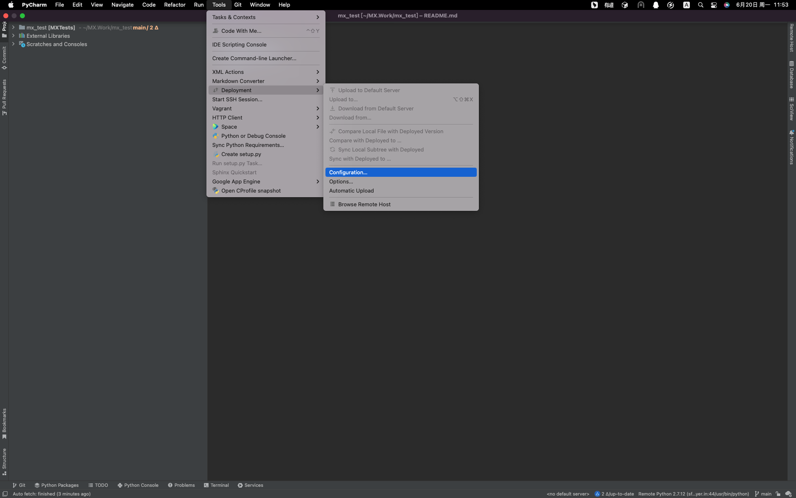
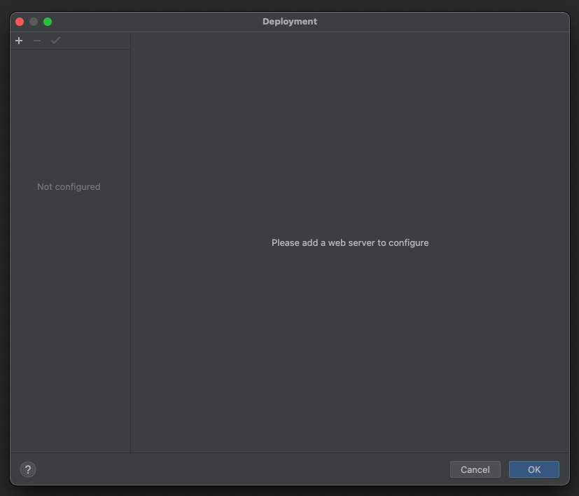
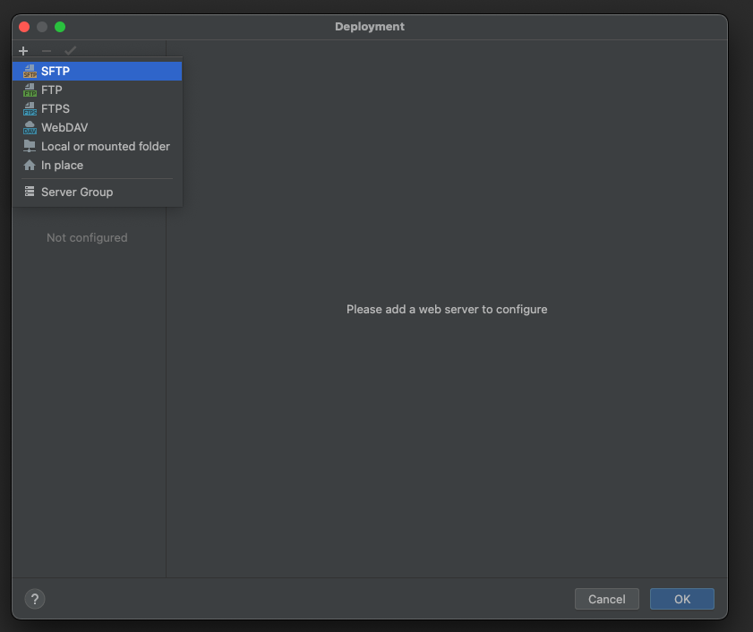
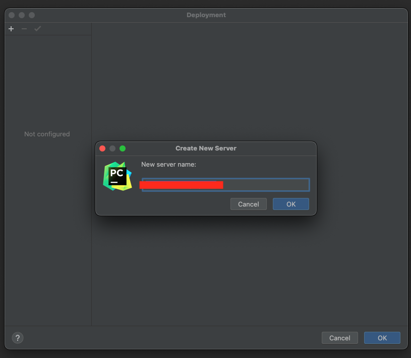
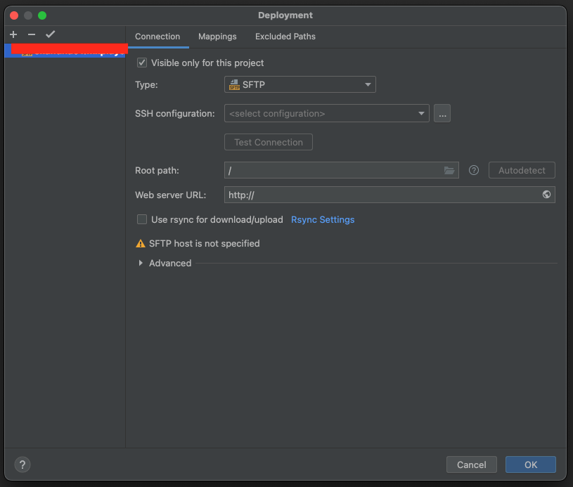
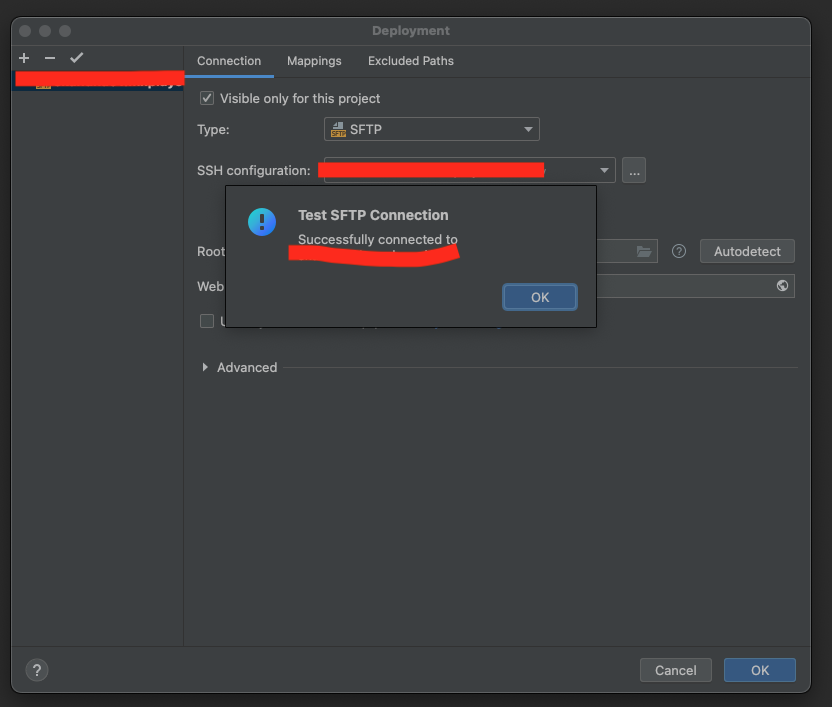
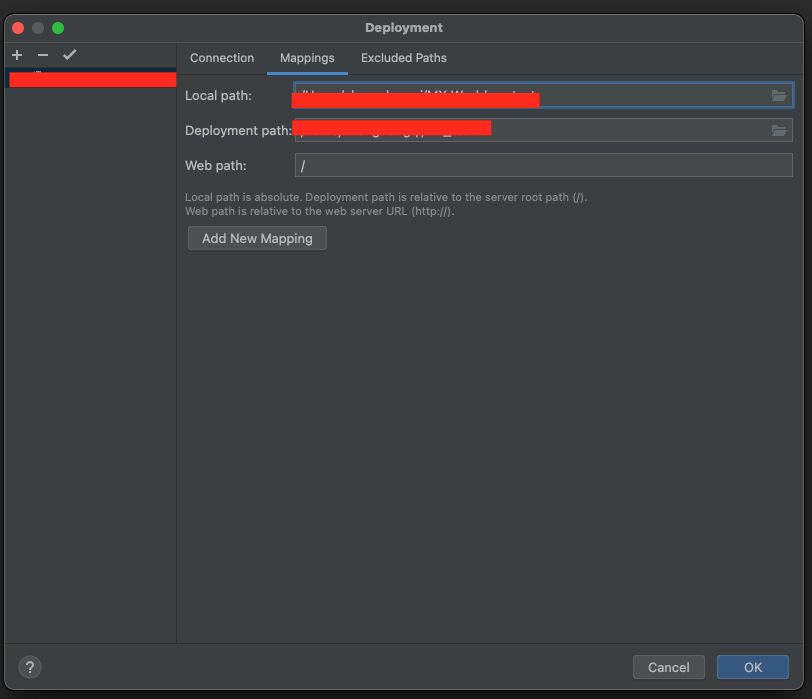
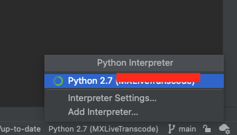
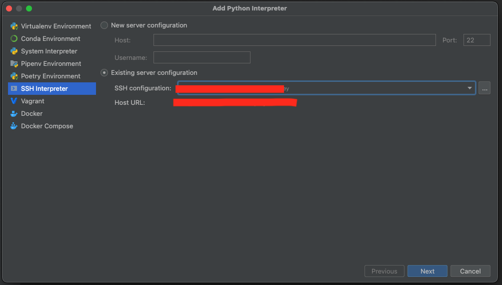
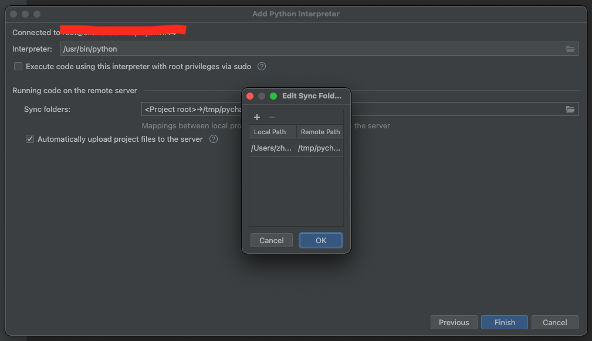

# Mac配置pycharm


## 恢复出厂配置

```bash
# configuration
rm -rf ~/library/preferences/JetBrains/
# caches
rm -rf ~/library/caches/JetBrains/
# plugins
rm -rf ~/library/application support/JetBrains/
# logs
rm -rf ~/library/logs/JetBrains/
```

## 文件头部

Python

```python
# !/usr/bin/env python
# -*- coding: utf-8 -*-

"""
@Author  : ${USER}
@Email   : dongqi.zheng@mxplayer.in
@Usage   :
@FileName: ${NAME}.py
@DateTime: ${DATE} ${TIME}
@SoftWare: ${PRODUCT_NAME}
"""
```

Shell

```bash
# !/bin/bash
```


## 远程调试

### 1.添加SFTP文件传输















### 2.添加ssh解释器






