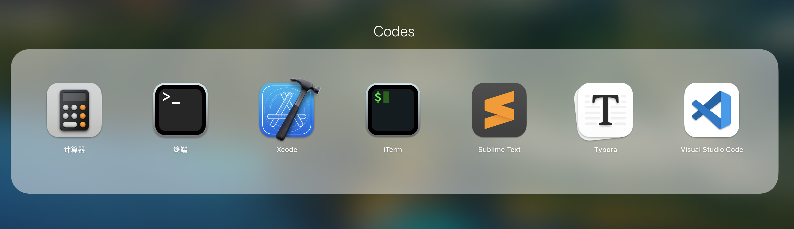

# mac
[mac配置bash](./01.Mac默认zsh.md)

[mac配置homebrew](https://brew.sh/index_zh-cn)

[mac配置redis](./04.Mac配置redis.md)

[mac配置mysql](./05.Mac配置mysql.md)

[mac配置iterm2](./07.Mac配置ITerm2.md)

[mac配置其它](./12.Mac配置bash_profile.md)

## codes

[VSCode](https://code.visualstudio.com)

[sublime](http://www.sublimetext.com)

[iterm2](https://iterm2.com)

[typora](https://www.typora.io)

## Develop Tools

RDM

[Royal TSX](https://royalapps.com)

[postman](https://www.postman.com/downloads/)

[sourceTree](https://www.sourcetreeapp.com)

[wireshark](https://www.wireshark.org)

[docker](https://www.docker.com)

[anaconde](https://www.anaconda.com)

[github desktop](https://desktop.github.com)

[mysql workbench](https://dev.mysql.com/downloads/workbench/)

[robo](https://robomongo.org)

## 其它

[cleanmymac](https://cleanmymac.cn/?utm_source=baidu&utm_medium=cpc&utm_campaign=speed&utm_content=text_ads&hmsr=baidu&hmpl=cpc&hmcu=speed&hmci=text_ads&bd_vid=11928149464131432885)

[chrome](https://www.google.cn/chrome/)

[pandaVPN](https://origin.huchezai.com)

[百度网盘](
